# MOINA 사용자 가이드

버전 `v0.1.28` · 한국어 기본 UI · 데스크톱과 모바일

이 문서는 MOINA를 **쓰는 사람**을 위한 안내입니다. 서비스를 설치·설정·운영하는 방법은
[관리자 가이드](ADMIN_GUIDE.md)에 있습니다. 화면에 보이지 않는 메뉴나 꺼져 있는 기능은
관리자가 정한 설정이므로, 그런 경우에는 관리자에게 문의하세요.

이 문서의 모든 화면 캡처는 `v0.1.28` 서비스를 실제로 띄워 찍은 것이며, 등장하는 계정과
글은 캡처 전용 데이터베이스에 만든 예시입니다.

---

## 1. 이 제품이 하는 일

MOINA는 사람·관심사·지식이 모이는 사내용 소셜 지식 네트워크입니다. 짧은 생각을 **Moin**
으로 올리면 관심사가 겹치는 사람에게 흘러가고, 답글 **Echo**와 재공유 **Remoin**으로
대화가 이어집니다. 흩어져 있던 링크·메모·질문을 한곳에 쌓아 두고 나중에 검색해 찾는 것이
목적입니다.

읽는 화면은 **Flow**입니다. Flow에는 두 가지가 있습니다. **Following**은 내가 Link(팔로우)한
계정의 최신 Moin을 시간순으로 보여 주고, **For Me**는 관심 Topic·Link 관계·최신성·새로운
발견 비율을 반영해 순서를 정합니다. 추천 비율은 내가 직접 바꿀 수 있고, 각 Moin이 왜
보이는지도 카드에서 열어 볼 수 있습니다.

쓰는 사람은 조직 구성원입니다. 로그인은 관리자가 만든 로컬 계정이나 조직의 Keycloak
계정(SSO)으로 하고, 외부 인터넷 없이 폐쇄망 안에서도 그대로 동작합니다. AI 어시스턴트,
이메일 알림, 팀장 검토·승인 같은 기능은 관리자가 켠 조직에서만 화면에 나타납니다.

---

## 2. 처음 5분

로그인부터 첫 Moin을 올리기까지 한 번에 따라 할 수 있는 길입니다.

### 2.1 로그인

관리자가 알려 준 주소를 열면 로그인 화면이 나옵니다. **사용자 이름**과 **비밀번호**를 넣고
**로그인**을 누릅니다. 조직이 SSO를 쓰면 이 화면에 Keycloak 로그인 버튼이 함께 보이고,
인증을 마치면 원래 열려던 화면으로 돌아옵니다.

카드 아래 `moina v0.1.28`이 지금 쓰는 서비스 버전입니다. 문제를 알릴 때 이 값을 함께
전달하면 확인이 빠릅니다.

### 2.2 Flow 둘러보기

로그인하면 **플로우** 화면이 열립니다. 위쪽 **For Me**와 **Following** 탭으로 두 종류의 Flow를
오갑니다. 오른쪽에는 지금의 펄스(인기 Topic)와 새로운 연결 제안이 붙습니다.

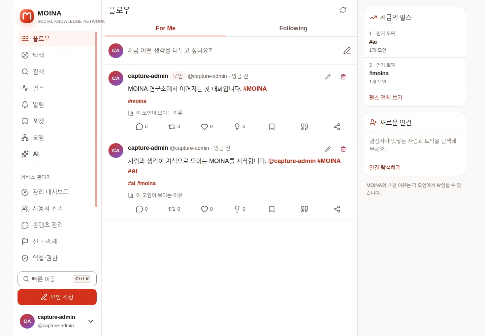

### 2.3 첫 Moin 올리기

1. Flow 맨 위 작성기(**지금 어떤 생각을 나누고 싶나요?**)를 선택하거나, 왼쪽 아래 **모인 작성**
   버튼을 누릅니다. 입력란 밖에서 `C`를 눌러도 됩니다.
2. 본문을 씁니다. `#주제`를 붙이면 Topic이 되고, `@사용자아이디`를 입력하면 자동완성 목록에서
   방향키와 `Enter`·`Tab`으로 사람을 고를 수 있습니다.
3. 화면 캡처는 작성 영역에서 `Ctrl/⌘+V`로 바로 붙여 넣습니다. JPEG·PNG·GIF·WebP 이미지와
   MP4·WebM 동영상은 끌어 놓거나 첨부 버튼으로 고릅니다.
4. 공개 범위를 확인하고 **모인하기**를 누르거나 `Ctrl/⌘+Enter`로 게시합니다.

올린 Moin은 카드의 연필 아이콘으로 수정하고 휴지통 아이콘으로 지웁니다. 본문을 고치면
카드에 **수정됨** 표시가 붙습니다.

> 개인정보·비밀번호·API 키·조직 비밀은 올리지 마세요. 공개 범위는 게시 전에 다시 확인합니다.

### 2.4 어디로든 빠르게 이동

어느 화면에서든 `Ctrl/⌘+K`를 누르면 **빠른 이동**이 열립니다. 화면 이름, 설정, 최근에 본
Moin·프로필·Topic·모임을 한 입력란에서 찾습니다. 일치하는 메뉴가 없으면 입력한 문장을
그대로 통합 검색으로 넘길 수 있습니다.

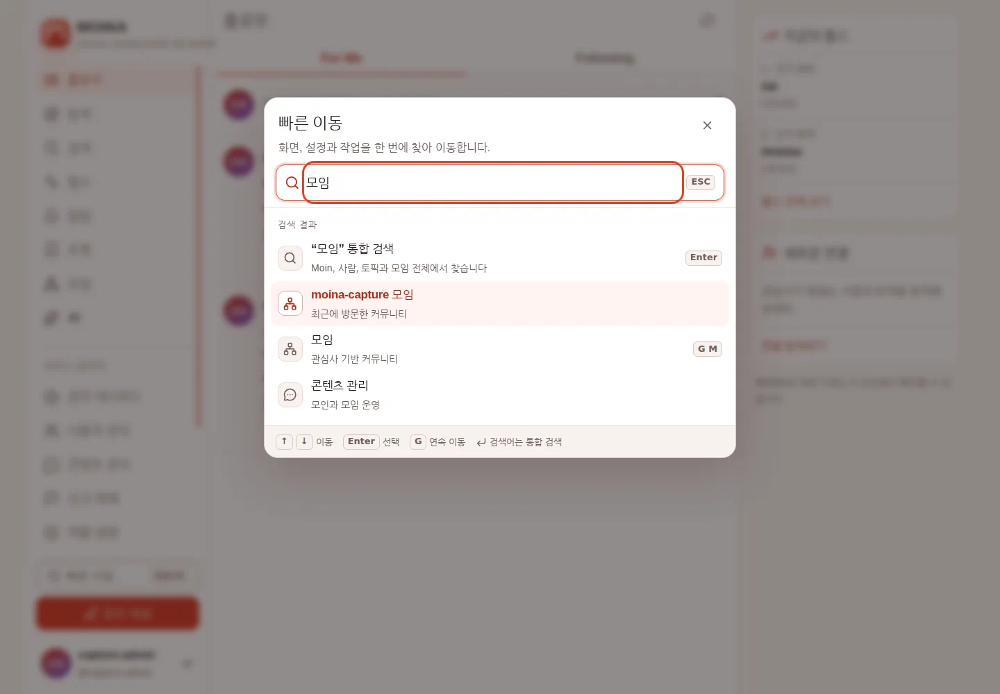

입력란과 대화 상자 밖에서는 `G`를 누른 뒤 `F`(플로우), `M`(모임), `N`(알림), `S`(검색)처럼
두 키를 이어 눌러 바로 이동할 수 있습니다.

---

## 3. 화면별 사용법

왼쪽 메뉴가 화면 목록입니다. 권한이 없는 화면은 메뉴와 빠른 이동 결과에서 아예 빠집니다.

### 3.1 플로우

For Me는 정책을 통과한 최근 Moin 최대 200개를 놓고 관심 Topic·최신성·Link 관계·새로운
발견 비율로 순서를 정합니다. 카드의 **이 모인이 보이는 이유**를 열면 그 Moin이 뽑힌 근거를
확인할 수 있습니다.

한 번 연 Flow는 그때의 점수와 설정을 유지하므로 **더 보기**로 다음 쪽을 불러도 순서가
흔들리지 않고, 이미 본 Moin이 다시 나오지 않습니다. 새로고침하면 최신 첫 쪽부터 다시
시작합니다.

카드 아래 줄에서 할 수 있는 일은 다음과 같습니다.

| 동작 | 언제 쓰나요 |
| --- | --- |
| Echo | 원문에 이어지는 의견이나 질문을 남길 때 |
| Remoin | 원문을 그대로 내 Link에게 알릴 때 |
| 공감 · 새로운 관점 | 공감하거나 다른 시각을 표시할 때(Signal) |
| 포켓 | 개인적으로 다시 볼 내용을 저장할 때 |
| 이 모인 인용 | 원문을 인용하며 내 생각을 덧붙일 때 |
| 모인 주소 복사 | 이 Moin의 주소를 다른 곳에 전달할 때 |

이 동작들은 누르는 즉시 화면에 반영됩니다. 서버 저장이 실패하면 이전 상태로 되돌아가고
한국어 안내가 뜨므로, 반복해서 누르지 말고 연결 상태를 확인하세요.

### 3.2 탐색

**탐색**은 팔로워 수가 아니라 활동과 연결을 기준으로 새 Topic과 사람을 추천합니다. Topic
카드의 **Link** 버튼을 누르면 사람을 Link하지 않아도 그 주제가 For Me에 반영됩니다.

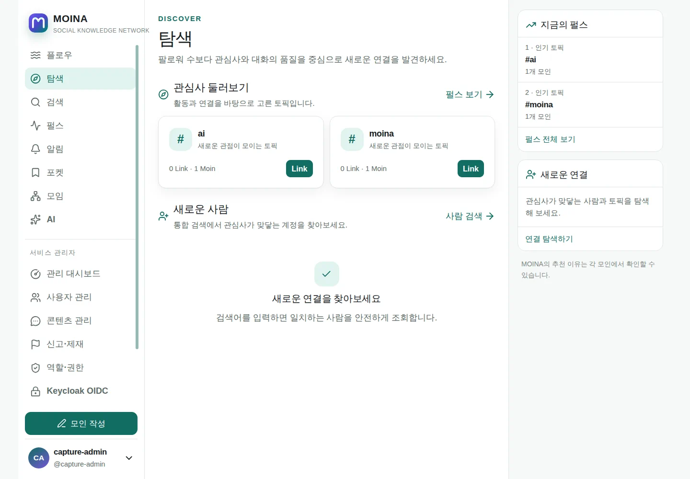

### 3.3 검색

**통합 검색**은 Moin·사람·토픽·모임을 한 번에 찾고, 탭으로 결과를 좁힙니다. 정확한
이름과 해시태그를 우선하면서 부분 문자열과 본문 관련도까지 함께 보므로 한국어 문장을
자연스럽게 입력해도 됩니다.

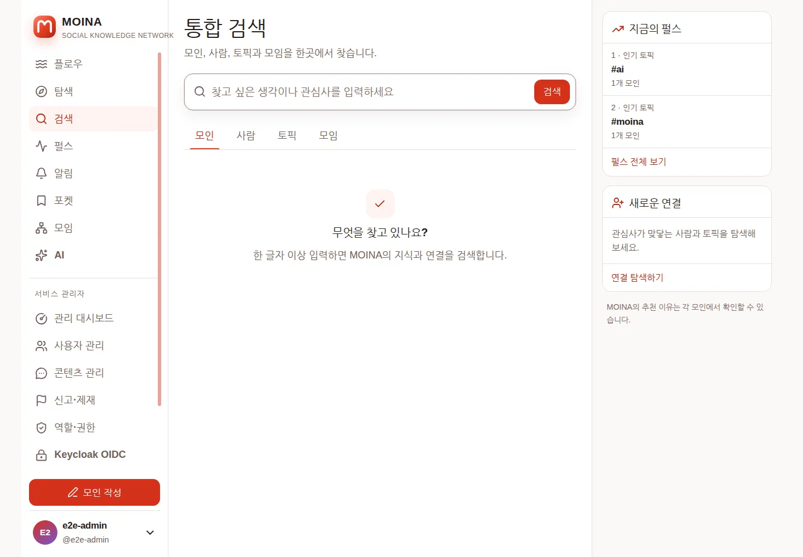

### 3.4 펄스와 Topic

**펄스**는 최근 7일의 공개 Moin과 Signal을 점수화하되 최근 24시간 활동에 더 큰 가중치를
두어 지금 커지는 주제를 보여 줍니다. 순위를 누르면 그 Topic 화면으로 이동합니다.

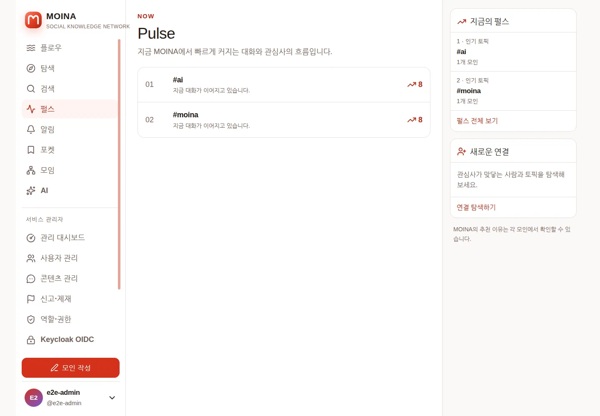

Topic 화면에서는 **이 토픽 Link** 버튼으로 주제를 Link하고, 아래 **관련 모인**에서 그 주제의
Moin을 읽습니다.

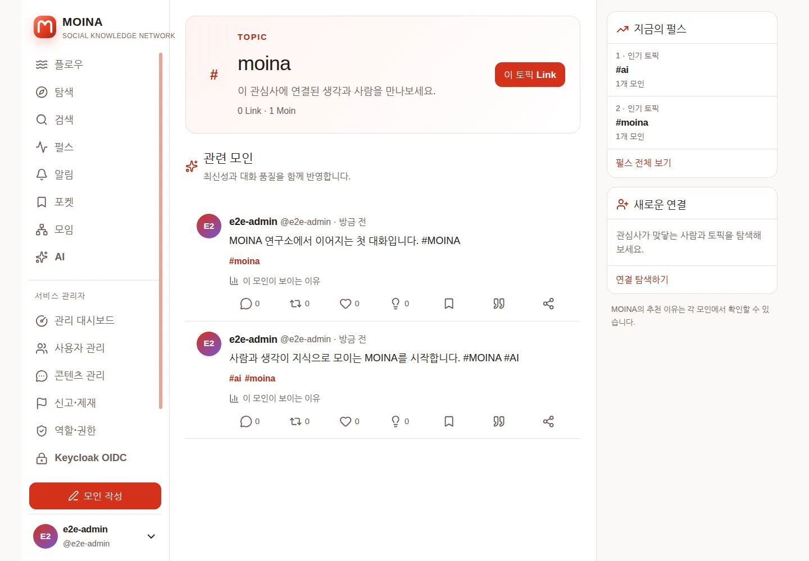

### 3.5 알림

**알림**은 멘션, Signal, 새로운 Link, Echo·인용·Remoin과 운영 알림을 실시간으로 모읍니다.
**전체·멘션·Signal** 탭으로 좁혀 볼 수 있습니다. 어떤 활동을 받을지는 [3.8 개인 설정](#38-개인-설정)에서
정합니다.

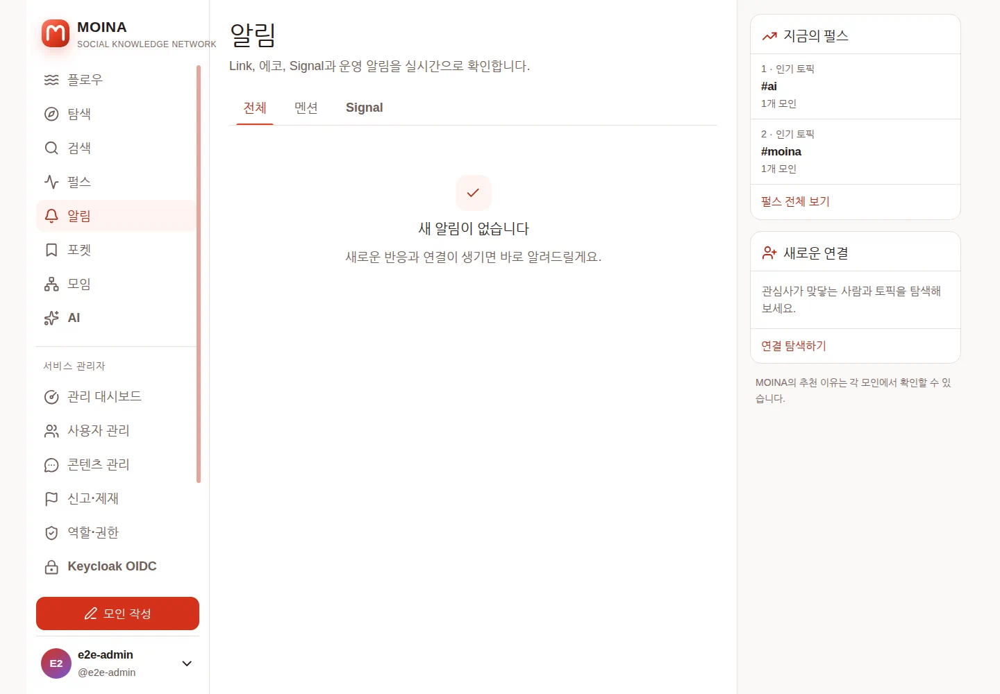

연결이 잠시 끊겨도 자동으로 다시 연결되고, 읽지 않은 수는 60초마다 서버와 다시 맞춥니다.

### 3.6 포켓

Moin 카드의 책갈피 아이콘으로 저장한 글이 **포켓**에 모입니다. 나중에 읽을 자료나 회의 전에
다시 볼 글을 개인적으로 모아 두는 곳이며, 저장 사실은 다른 사람에게 보이지 않습니다.

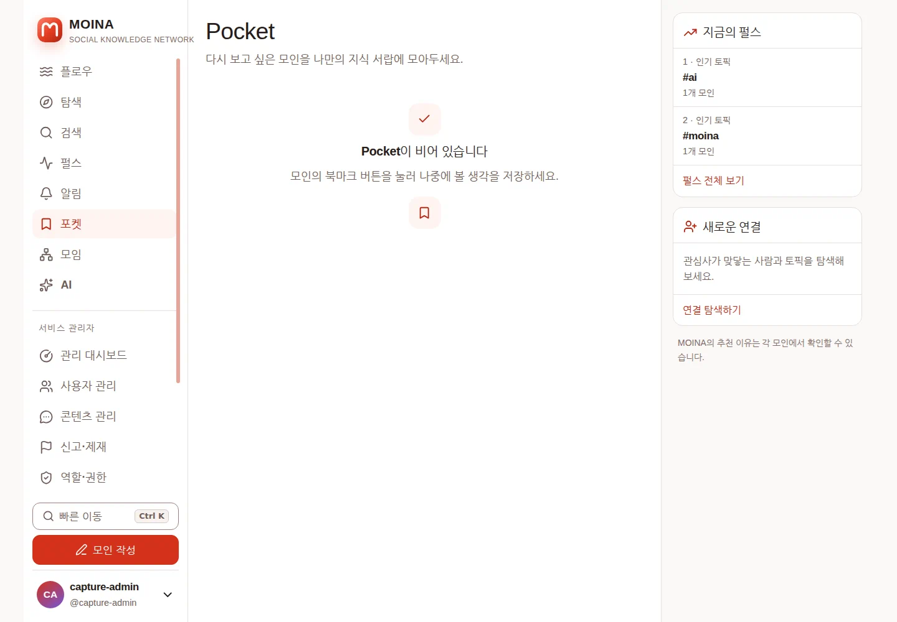

### 3.7 모임

**모임(Moim)**은 관심사별 대화 공간입니다. 목록에서 공개 모임에 참여하거나 새로 만들 수
있습니다.

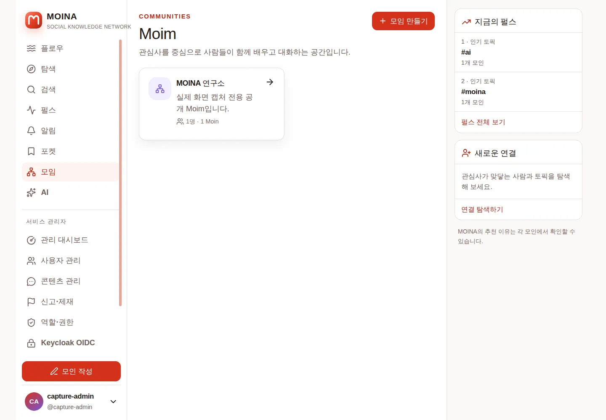

모임 상세 화면의 **새 대화 시작하기**에서 모임 전용 Moin을 올립니다. 이 작성기의 공개 범위는
**모임 공개**로 고정되어 바꿀 수 없고, 그 글의 Echo·인용·Remoin도 같은 모임 멤버에게만
보입니다. 모임에서 나가면 새 글을 쓰거나 기존 대화를 볼 수 없습니다.

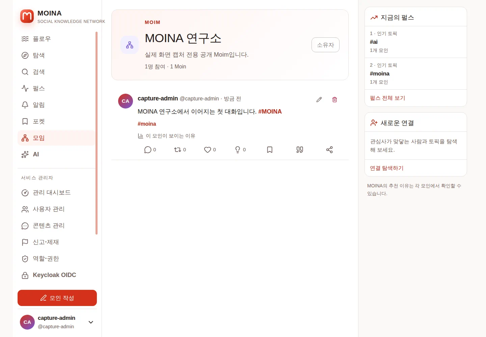

### 3.8 AI 어시스턴트

**AI** 메뉴가 보이면 관리자가 조직 내부의 OpenAI 호환 endpoint를 연결해 둔 것입니다. 대화
응답은 실시간 스트리밍되고 중지 버튼으로 언제든 끊을 수 있습니다. Moin을 자동으로
요약하거나 대신 써 주는 기능은 아닙니다.

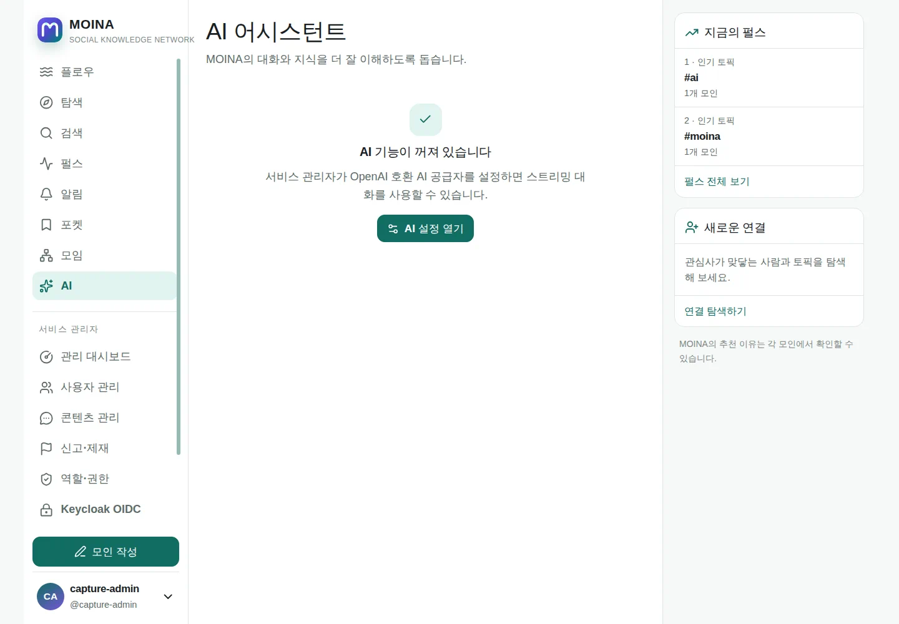

AI 응답은 사실을 보장하지 않습니다. 중요한 판단은 원문·출처와 조직 정책을 확인한 뒤에
하세요.

### 3.9 개인 설정

프로필 메뉴에서 설정으로 들어가면 왼쪽에 여섯 개의 항목이 있습니다.

**프로필 설정** — 다른 사람에게 보이는 프로필 이미지, 표시 이름, 이메일, 소개(500자 이내)를
관리합니다. 이미지는 JPEG·PNG·GIF·WebP를 고를 수 있고(파일당 최대 용량은 관리자가 정하며
캡처 시점 기준 10 MiB입니다), 캡처한 이미지를
이 영역에서 `Ctrl+V`로 붙여 넣어도 됩니다. **프로필 저장**을 눌러야 반영됩니다.

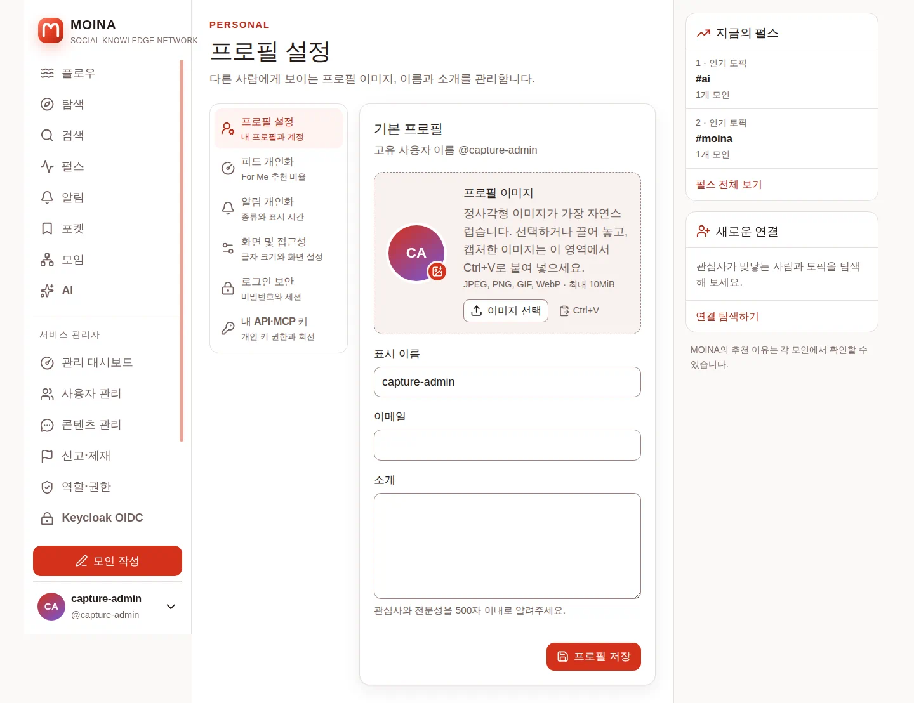

**피드 개인화** — For Me가 쓰는 네 가지 신호(관심 토픽·내가 Link한 사람·새로운 발견·최신성)의
비율과 **추천 이유 표시**, 제외할 Topic을 정합니다. 합계가 100일 필요는 없고, 바꾼 값은 새
첫 쪽부터 반영됩니다.

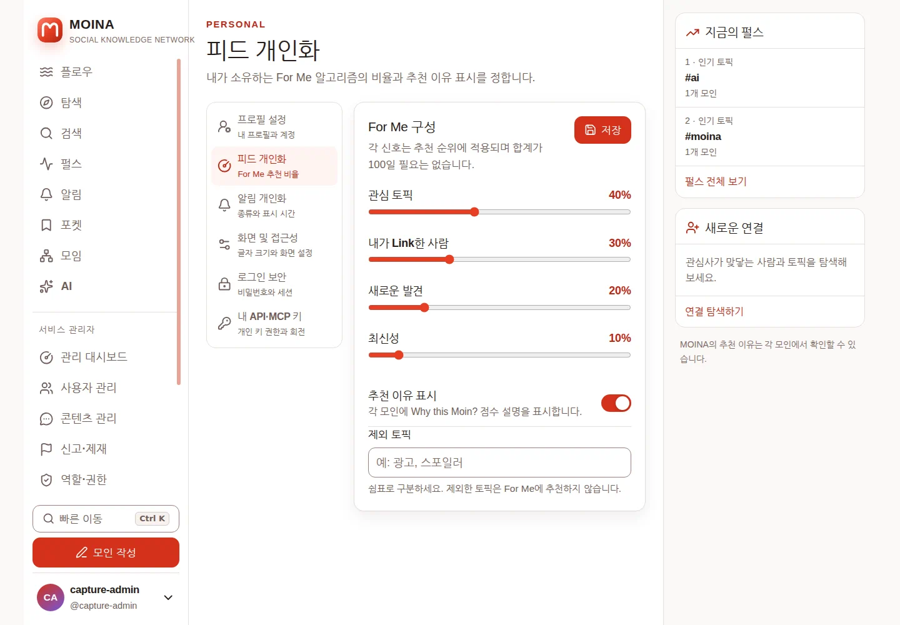

**알림 개인화** — 알림 받을 활동(멘션·Signal·새로운 Link·Echo·인용·Remoin), 실시간 표시
방식(앱 내 토스트·데스크톱 알림·이메일 알림), 알림 요약 주기와 조용한 시간을 정합니다.
**승인·보안 알림**은 필수 운영 기록이라 끌 수 없습니다.

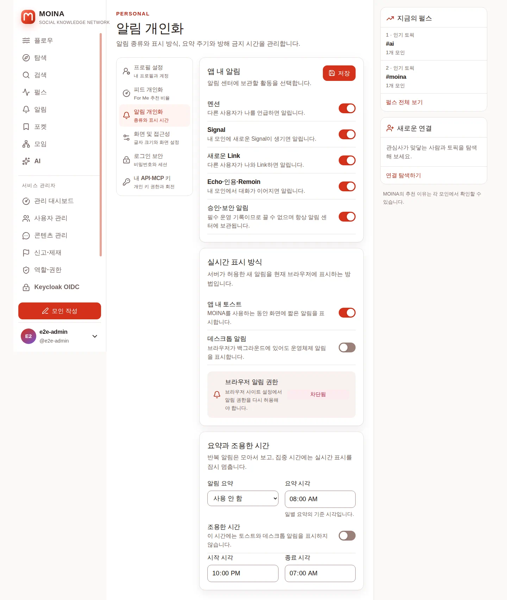

- 데스크톱 알림은 설정 버튼을 누른 그 동작에서 브라우저 권한을 허용해야 켜집니다.
- 이메일 알림은 관리자가 SMTP 메일을 준비한 뒤에 쓸 수 있고, 프로필 이메일로 갑니다.
- 조용한 시간에는 토스트·데스크톱 표시만 멈추고 알림 기록 자체는 그대로 남습니다.
- 알림 요약을 새로 켜거나 주기·시각을 바꾸면 그 시점부터 새 구간을 모으므로, 꺼져 있던
  동안의 알림이 한꺼번에 몰려 오지 않습니다.

**화면 및 접근성** — 글자 크기, 화면 테마(밝게·어둡게), 정보 밀도, 화면 움직임 줄이기를
계정에 저장합니다. 본문 기본 크기는 16px이며 확대하면 여백도 함께 조정됩니다.

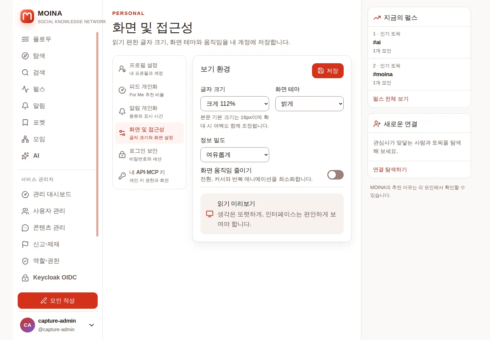

**로그인 보안** — 현재 인증 방식을 확인하고 로컬 계정의 비밀번호를 바꿉니다. 비밀번호는
12자 이상, UTF-8 기준 72바이트 이하이며, 변경하면 기존 로그인 세션이 모두 끝납니다.

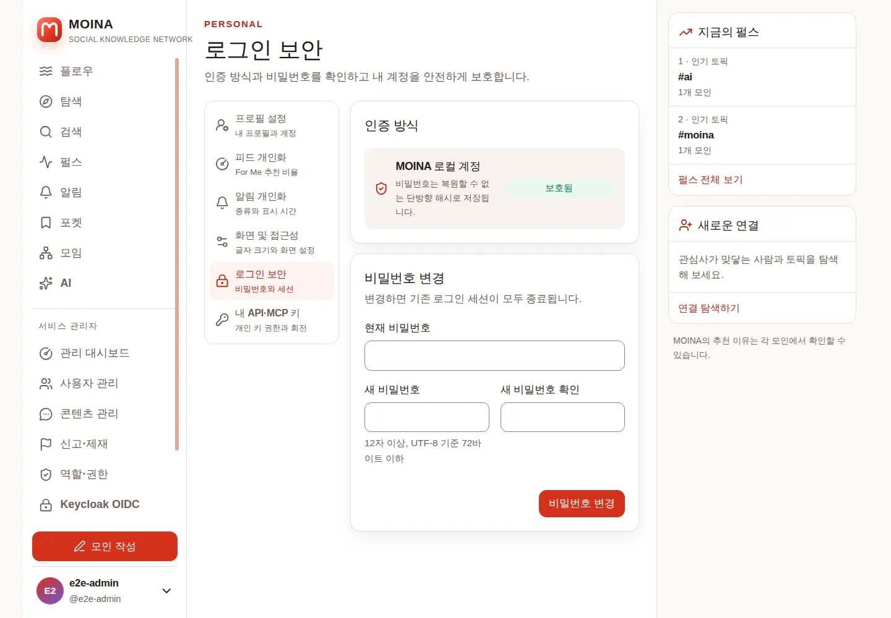

**내 API·MCP 키** — 아래 3.10을 보세요.

### 3.10 내 API·MCP 키

외부 도구나 MCP client에서 내 권한으로 MOINA를 쓰려면 개인 키를 만듭니다.

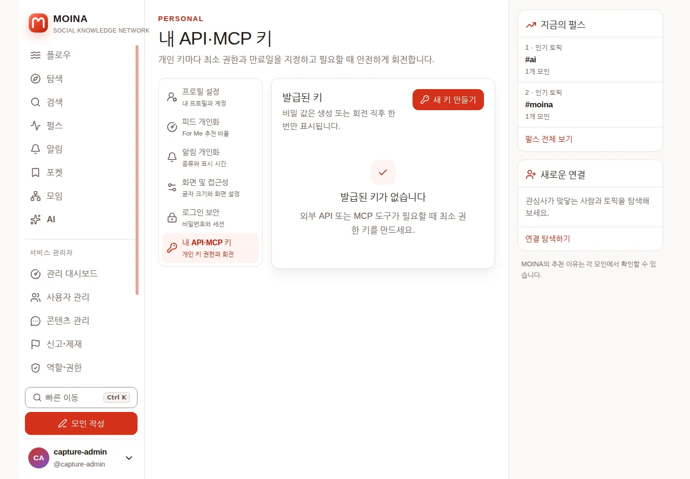

1. **새 키 만들기**를 누릅니다.
2. 그 용도에 꼭 필요한 최소 권한과 만료일만 고릅니다.
3. 만든 직후 **한 번만** 표시되는 원문 token을 안전한 곳에 보관합니다. 화면을 닫으면 다시 볼 수
   없습니다.
4. 노출이 의심되면 **회전**해 새 token으로 바꾸거나 즉시 폐기합니다. 회전하면 이전 token은
   그 즉시 쓸 수 없습니다.

목록에는 원문이 아니라 식별용 prefix, 권한, 최근 사용 시각과 만료 상태만 남습니다.

### 3.11 모바일 화면

같은 주소를 휴대전화에서 열면 같은 기능이 한 열 레이아웃으로 재배치됩니다. 왼쪽 메뉴는
상단 버튼으로 열고, 빠른 이동도 그대로 쓸 수 있습니다.

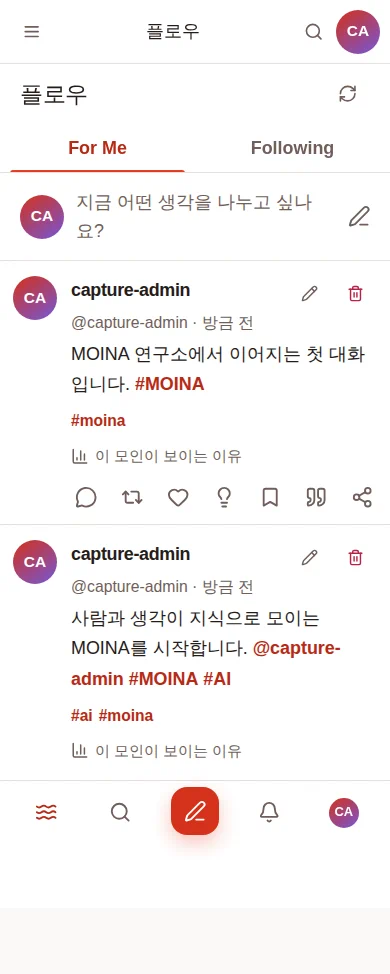

---

## 4. 자주 하는 작업

### 회의 화면을 캡처해 팀에 공유하기

1. 화면을 캡처해 클립보드에 복사합니다.
2. Flow 작성기를 열고 본문을 쓴 뒤 작성 영역에서 `Ctrl/⌘+V`를 누릅니다.
3. 미리보기에서 파일명·크기와 업로드 상태를 확인하고, 그 이미지가 이 Moin에서 전하는 내용을
   **대체 텍스트**에 적습니다.
4. 필요하면 `@사용자아이디`로 볼 사람을 부르고 게시합니다.

첨부가 실패하거나 취소된 상태가 남아 있으면 저장 버튼이 막힙니다. 해당 첨부를 지우거나
다시 올린 뒤 게시하세요.

### 관심 주제를 내 Flow로 모으기

1. **탐색**이나 **펄스**에서 주제를 찾습니다.
2. Topic 화면이나 카드의 **Link**를 누릅니다.
3. **설정 → 피드 개인화**에서 관심 토픽 비율을 올리고, 보고 싶지 않은 주제는 제외 토픽에
   적습니다.
4. 다음 Flow 새로고침부터 반영됩니다.

### 나중에 볼 글 모으기

Moin 카드의 책갈피 아이콘을 누르면 **포켓**에 저장됩니다. 저장을 풀려면 같은 아이콘을 다시
누릅니다.

### 알림을 하루 한 번으로 묶기

**설정 → 알림 개인화 → 요약과 조용한 시간**에서 알림 요약을 매일로 바꾸고 요약 시각을
정합니다. 멘션·승인·보안 메일은 요약하지 않고 즉시 보냅니다. 집중 시간에는 조용한 시간을
켜 토스트와 데스크톱 알림만 잠시 멈춥니다.

### 외부 도구용 키를 안전하게 교체하기

**설정 → 내 API·MCP 키**에서 해당 키의 회전을 실행하고, 새 token을 도구 설정에 넣습니다.
더 쓰지 않는 키는 폐기하고, 만료일이 없는 키가 남아 있지 않은지 주기적으로 확인하세요.

### 원하지 않는 계정·글에 대응하기

원하지 않는 계정은 차단하거나 음소거할 수 있습니다. 정책을 어긴 Moin·계정·모임은 대상과
사유·설명을 적어 신고합니다. `v0.1.28`의 사용자 화면은 신고 처리 결과를 알림으로 알려 주지
않으므로, 후속 확인은 조직의 운영 담당자 절차를 따르세요.

---

## 5. 막혔을 때

화면에 실제로 나오는 메시지와 그때 할 일입니다.

| 화면에서 보이는 것 | 무엇을 하면 되나요 |
| --- | --- |
| 로그인이 반복되고 다시 로그인 화면으로 돌아옴 | 브라우저 쿠키 허용, 접속 주소, 기기 시간을 확인합니다. SSO를 쓴다면 관리자에게 OIDC redirect URL 확인을 요청하세요. |
| **접근 권한이 없습니다** 화면 | 그 화면에 필요한 권한이 없습니다. 관리자에게 내 역할과 유효 권한 확인을 요청하세요. |
| **페이지를 찾을 수 없습니다** 화면 | 주소가 틀렸거나 대상이 삭제됐습니다. 왼쪽 메뉴나 빠른 이동으로 돌아가세요. |
| **AI 기능이 꺼져 있습니다** | 관리자가 AI 공급자를 아직 연결하지 않았습니다. 관리자에게 문의하세요. |
| 이메일 알림 스위치가 켜지지 않음 | 관리자가 SMTP 메일을 설정해야 켤 수 있습니다(화면에 **대기**로 표시됩니다). |
| 알림이 실시간으로 오지 않음 | 잠시 기다리면 자동 재연결됩니다. 계속 오지 않으면 WebSocket을 막지 않는 회선인지 관리자에게 확인을 요청하세요. |
| Flow 새로고침이 잠시 거부됨 | 같은 계정의 다른 새로고침과 겹친 경우입니다. 안내대로 1초 뒤 한 번만 다시 시도합니다. |
| 더 보기 뒤 Flow가 처음으로 돌아감 | 유지 중이던 순서가 만료됐습니다. 반복 새로고침을 줄이고 최신 첫 쪽부터 다시 읽습니다. |
| 첨부가 거부되고 지원 형식 안내가 뜸 | 파일 형식·크기·개수 제한을 확인합니다. 아이폰 HEIC 사진이라면 아래 안내를 보세요. |
| 업로드 quota 오류 | 게시물·프로필에 연결하지 않은 업로드가 100개 또는 512 MiB에 도달했습니다. 기존 업로드를 글에 연결하거나 관리자가 정한 정리 시간을 기다립니다. |
| 화면이 예전 그대로처럼 보임 | 로그인 화면에서 버전을 확인하고 브라우저를 강력 새로고침합니다. |

**아이폰에서 찍은 사진(HEIC·HEIF)이 첨부되지 않을 때** — MOINA는 HEIC·HEIF를 받지
않습니다. 아이폰의 **설정 > 카메라 > 포맷**에서 **높은 호환성**을 선택하면 이후 사진이 JPEG으로
찍히고, 이미 찍은 사진은 JPEG으로 내보낸 뒤 첨부하면 됩니다.

그래도 해결되지 않으면 발생 시각, 내 사용자 아이디, 열려 있던 경로, 화면에 표시된 오류
문구와 서비스 버전을 관리자에게 전달하세요. 비밀번호와 token은 절대 함께 보내지 않습니다.

---

## 6. 용어

| 화면에 나오는 말 | 뜻 |
| --- | --- |
| Moin(모인) | 짧은 생각·사진·링크를 공유하는 게시물 |
| Echo(에코) | Moin에 이어지는 답글 |
| Remoin(리모인) | 다른 사람의 Moin을 내 Flow로 다시 퍼뜨리는 것 |
| Link(링크) | 사람 또는 Topic을 팔로우하는 것 |
| Signal(시그널) | 공감·Insight 같은 반응을 묶어 부르는 말 |
| Flow(플로우) | 나에게 흐르는 개인화 피드. For Me와 Following 두 종류 |
| For Me | 관심사와 관계, 최신성으로 순서를 정한 Flow |
| Moim(모임) | 관심사 기반의 커뮤니티 공간 |
| Topic(토픽) | `#`로 붙는 주제 태그 |
| Pulse(펄스) | 지금 주목받는 Topic 목록 |
| Pocket(포켓) | 나중에 볼 Moin을 저장하는 개인 보관함 |
| 빠른 이동 | `Ctrl/⌘+K`로 여는 화면·설정·검색 통합 이동 창 |

---

## 더 보기

- [관리자 가이드](ADMIN_GUIDE.md) — 설치, 설정, 권한, 운영
- [REST API와 MCP](api-mcp.md) — 개인 키로 외부 도구를 연결할 때
- [제품 소개](https://hkjang.github.io/moina/)
